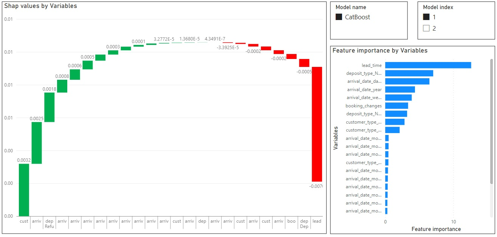

### Calculating statistics and SHAP values
This folder contains a simple class `CalStatistics` to calculate many statistics (VIF, t-test, correlations and distance correlations) on given variables of a dataframe and to calculate feature importance and SHAP values by training K CatBoost and XGBoost regression models. It also converts all the results to dataframes to allow easier storage of the data or importing in PowerBI dashboard.

SHAP values can also be extracted from the `shap_df` output and visualized using visualization functionalities in [SHAP](https://shap.readthedocs.io/en/latest/) package. An example of waterfall visualization in PowerBI is shared at `./data/shap_values_visualization.pbix`:

A notebook example `example_calculate_stats.ipynb` is provided to show how to calculate some of the statistics given a list of variables and populate SHAP values for a problem that is cast as a regression task on a Kaggle hotel booking dataset. There is also an example of using SHAP values from one of the models and populate different SHAP visualizations.

Please note the features and target variables are selected for illustration purposes. The models can also be improved by running more tunning experiments.

